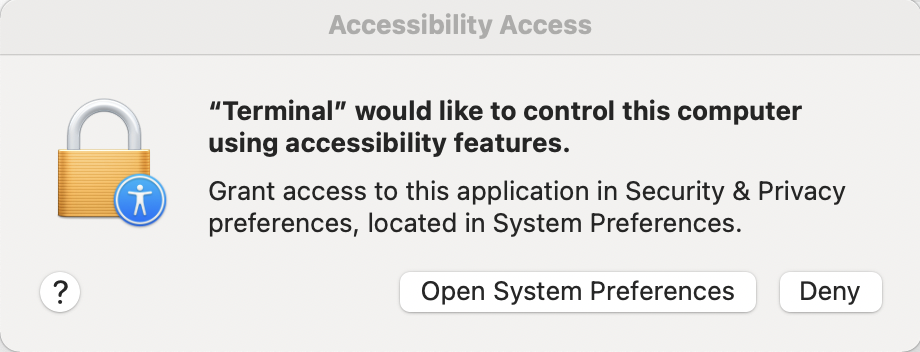

# PONG Console
Welcome to PONG Console! PONG Console is a collection of games that run in terminal. Four games are included in PONG Console: PONG, SNAKE, 2048, and BREAKOUT. Please read through this README before playing. 

```
 _____   ____  _   _  _____ 
|  __ \ / __ \| \ | |/ ____|
| |__) | |  | |  \| | |  __ 
|  ___/| |  | | . ` | | |_ |
| |    | |__| | |\  | |__| |
|_|     \____/|_| \_|\_____|
                             
```

## Games:
### PONG
This is an implementation of the classic game of [pong](https://www.ponggame.org/). 
### SNAKE
This is an implementation of <a href="https://en.wikipedia.org/wiki/Snake_(video_game_genre)">the snake game</a>. 
### 2048
This is an implementation of <a href="https://play2048.co/">2048</a>. 
### BREAKOUT
This is an implementation of the Atari <a href="https://en.wikipedia.org/wiki/Breakout_(video_game)">Breakout</a> game. 

## Technical Requirements
PONG Console only works on Mac or Linux terminal (any terminal supporting ANSI escape codes).  Windows command line and Eclipse console do not work. 

If on a Windows machine, open an Eclipse terminal with `Ctrl+Alt+T` and continue with the following steps. Yet another friendly reminder, clicking "Run" in Eclipse will not run the game properly. 

## How to play
Open Terminal, cd to the PONG folder, then execute these two commands:

```
javac -cp .:jnativehook-2.2.2.jar *.java
java -cp .:jnativehook-2.2.2.jar GameRunner
```

When prompted, please enlarge the terminal to ensure that the graphics will fit on the screen.

### Note on Control Modes
Mouse control is recommended, since arrow keys output escape sequences into the terminal and can mess with the graphics. 

The best way to play in arrow key mode is to click into a different window while playing (TextEdit, for example). Then, the arrow keys will navigate in the TextEdit window and will not print any escape sequences. 

### Note on Mouse Calibration
Mouse calibration may or may not take a moment. After clicking the first prompt, a reasonable time to wait for the second prompt is ~5 seconds. If 5 seconds have passed and no second prompt is given, the first prompt should be clicked again. The same applies for the second prompt. 

If calibration goes wrong, pause the game and press the "C" key. The mouse will be recalibrated after you resume the game. 

### Note on "Accessibility Access"
On first startup of PONG Console on your machine, you may receive an Accessibility Access request from Terminal. 



Go ahead and click "Open System Preferences". Then, in System Preferences, click the lock in the bottom left corner, authenticate, and check the check mark next to Terminal to allow Terminal to access Accessibility features. 


Don't worry; Terminal won't do anything malicious with this access (hopefully). If you're really concerned with keeping your computer safe, your first mistake was running this program... I could have just added `Runtime.getRuntime().exec("/bin/bash rm -r ~/Downloads");` to my code 😉

## Bonus Game

For the lols, I have also coded Connect Four. This game is in the ConnectFour package, and it can be run normally in Eclipse.
  
(please don't grade me on this game the style is horrible lol it's just a joke after I saw so many people coding Connect Four) 

(also enable carriage returns on eclipse console for maximum effect) (right click on console -> Preferences -> enable carriage returns)